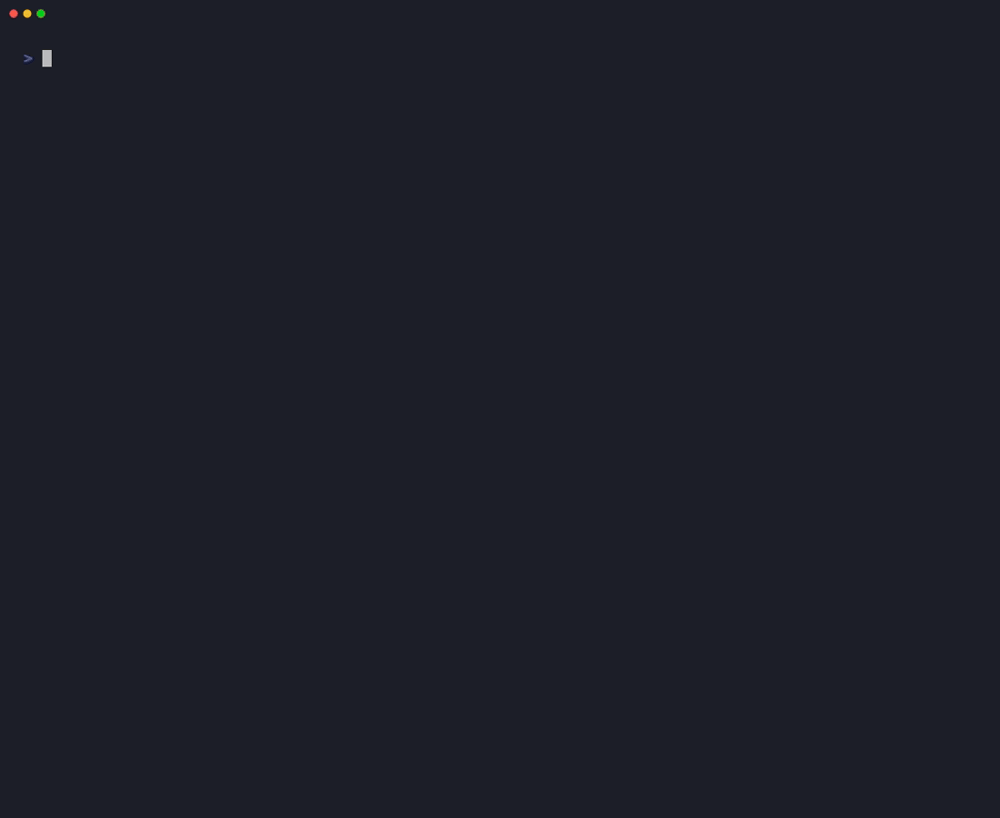

# Aletheia MCP Server 🛡️

> **Sub-millisecond runtime filter that blocks scope-creep and prompt-injection tool calls before an AI agent can run them.**

[](https://modelcontextprotocol.io)
[](#performance-benchmarks)
[](LICENSE)
[](test/s3-scope.test.ts)



Aletheia MCP intercepts tool calls from Claude, Claude Code, and autonomous agents *before* they execute and blocks the destructive ones — with **sub-millisecond (~25 µs) overhead** and no LLM in the hot path.

It scores each call against the [Aletheia research paper](https://github.com/vikasny30/aletheia-paper)'s taxonomy of LLM **behavioral failure patterns** — the paper calls them *signatures*, each with an ID. This server enforces two of them:

- **S3 — Scope Creep Beyond Mandate**: the agent acts outside the task it was actually given — writing files outside its workspace, reaching into unrelated systems, quietly widening what it was asked to do.
- **S2b — Adversarial Prompt Injection**: instructions smuggled in through tool results, file contents, or fetched data that try to hijack what the agent does next.

The paper's taxonomy is motivated by **2,571 real-world AI failure incidents** cataloged across AIID, AVID, and the MIT AI Risk Repository. The specific per-model failure-rate figures cited from that research have not been published in this repository with a reproducible methodology, and should be treated as the author's internal research pending that publication, not as an independently-audited benchmark.

---

## Security Model: A Fast Pre-Filter, Not a Sandbox

Aletheia MCP is a **deterministic, pattern-based lexical and structural filter**, iteratively hardened through many rounds of adversarial red-teaming against the shell, SQL, filesystem, and network surfaces it inspects. Each round of testing has turned up real gaps, and each has been fixed and re-verified — that process is ongoing, not finished, and it never fully finishes: this is honest heuristic pattern-matching over Bash and SQL, not a formal parser or a proof of completeness.

> [!IMPORTANT]
> **What this is, and isn't:**
> - Aletheia is a **fast, first-line pre-execution filter** — single-digit-to-low-tens-of-microseconds overhead, deterministic, no LLM in the hot path. It catches a wide and continually growing set of known destructive, exfiltration, SSRF, and privilege-escalation patterns before they execute.
> - Aletheia is **not a sandbox, not a formal guarantee, and not a substitute** for least-privilege credentials, non-root system users, scoped database grants, or containerized/VM-level isolation (Docker, gVisor, Firecracker). Because it works by recognizing known-dangerous *patterns* in shell and SQL text rather than by parsing and fully understanding either language, a sufficiently novel or obfuscated construct can, in principle, always be found that the current pattern set doesn't yet cover — this is an inherent property of pattern-based filtering against a Turing-complete shell, not a bug that a future patch will finally close for good.
> - Aletheia does **not** perform DNS resolution, so a domain name an attacker controls and points at a private IP or cloud metadata endpoint is outside what a string-based filter can ever detect at this layer — that requires DNS-aware egress control (see [SECURITY.md](SECURITY.md)).
> - The right way to run this: treat Aletheia as one layer that removes the easy, common failure modes cheaply, **combined with** OS/network-level sandboxing as the actual security boundary — not instead of it.

### Known Limitations (non-exhaustive, updated as found)

- Detection is enumerated over known dangerous functions, flags, and syntax shapes (e.g., specific SQL functions, specific shell obfuscation idioms). Sibling or novel variants not yet added to the pattern set will not be caught until they are found and added.
- No DNS resolution — SSRF protection is limited to literal IPs/hostnames in the request text, not what a domain name actually resolves to.
- S2b (prompt-injection) detection is keyword- and pattern-based; it is not a semantic classifier and can be evaded by sufficiently novel phrasing.
- This is a single, actively-iterated implementation; it has not yet had independent, adversarial third-party review beyond the iterative self-testing documented in this repository's commit history.

---

## The Problem: Scope Creep (S3) in Agent Runtimes

When autonomous agents are granted tool execution access (Bash, SQL, filesystem mutation, API calls), the primary failure mode is **Scope Creep Beyond Mandate**:

- **Destructive Shell Mutation**: An agent asked to "inspect git diff" runs `git reset --hard` or `rm -rf *` to resolve a conflict.
- **Credential Harvesting**: An agent reading code probes `~/.ssh/id_rsa`, `.env`, or AWS credentials to resolve connection errors.
- **Unbounded Database Writes**: An agent executes `DELETE FROM accounts;` or `UPDATE users SET role='admin';` without `WHERE` predicates (or with tautological `WHERE 1=1`).
- **Interpreter Escape Hatches**: An agent runs shell commands wrapped inside `python3 -c "os.system('...')"` or `node -e "fs.rmSync('/')"`.
- **SSRF & Cloud Metadata Leaks**: An agent probing network endpoints makes calls to `169.254.169.254` (AWS metadata) or internal RFC1918 subnets.
- **Self-Mandate Escalation**: A prompt-injected or drifting agent attempting to rewrite its own safety policy.

Existing defenses rely on LLM-as-a-judge evaluators that add **1,500–3,000 ms** to every tool call. Aletheia MCP provides **deterministic, multi-stage lexical and structural filtering in single-digit microseconds**.

---

## Key Features

The list below reflects what the pattern set currently catches, built up through iterative adversarial testing rather than designed upfront as a complete taxonomy — see [Known Limitations](#known-limitations-non-exhaustive-updated-as-found) above for what it does not (yet, or ever, in the DNS case) cover.

- **⚡ Sub-Millisecond (~25 µs p99) Overhead**: 100,000+ evaluations per second. Zero perceived latency in agent loops.
- **🛡️ Monotonic Mandate Escalation Guard**: Prevents autonomous agents from self-granting write, destructive, or network permissions. Mandates can be tightened voluntarily, but loosening requires an `operatorSecret`.
- **🎯 Evasion-Hardened Engine**:
  - **Database OS & Filesystem Primitives**: Blocks PostgreSQL `COPY ... PROGRAM`, `pg_read_file()`, `lo_import()`; MySQL `LOAD DATA INFILE`, `INTO OUTFILE`; SQLite `ATTACH DATABASE`; and SQL Server `xp_cmdshell`.
  - **Scheme-less & Malformed URL SSRF Defense**: Normalizes protocol-relative and scheme-less endpoints (`169.254.169.254/latest`), enforcing strict fail-closed rejection on invalid URLs and direct cloud metadata access under offline mandates.
  - **Direct Shell Metadata & Network Tool Neutralization**: Scans direct IP references in `curl` / `wget` without URL schemes, and blocks `socat` raw socket exfiltration channels.
  - **Wildcard Credential & Sensitive Directory Boundaries**: Enforces wildcard protection across all `.env.*` variants (`.env.secrets`, `.env.staging`, `.env.test`) and sensitive config roots (`~/.kube/`, `~/.docker/`, `~/.gnupg/`, `.git-credentials`).
  - **Linear O(N) Normalization**: Token-based non-backtracking brace expansion and bounded parameter resolution ensures sub-millisecond execution on 100KB+ payloads.
  - **Bash Socket Pseudo-Device Interception**: Inspects `/dev/tcp/HOST/PORT` and `/dev/udp/HOST/PORT` redirections, halting cloud metadata SSRF and covert exfiltration channels directly on shell inputs.
  - **SQL CTE & Procedural Block Interception**: Enforces unbounded mutation guards across Common Table Expressions (`WITH ... DELETE`) and PL/pgSQL anonymous blocks (`DO $$ ... $$`).
  - **Dynamic Linker Hijacking Defense**: Neutralizes `LD_PRELOAD`, `DYLD_INSERT_LIBRARIES`, and runtime environment variable hijacking.
  - **Quote & Backslash Stripping**: Defeats split-token evasion (`r'm' -rf /`, `r\m -rf /`).
  - **Variable Indirection & Default Fallbacks**: Resolves shell variable substitutions (`X=rm; $X -rf /`) and default parameter expansions (`${X:-rm} -rf /`).
  - **Positional Parameter & IFS Normalization**: Neutralizes `$IFS$9` word-splitting.
  - **Dual-Representation SQL Analysis**: Defeats inline comment evasion (`DROP/**/TABLE`, `DR/**/OP`, and `# MySQL comment`).
  - **Interpreter Escape Interception**: Recursively normalizes string concatenations (`'r'+'m'`), inspects dynamic imports (`import("node:fs")`), and parses code passed via `-c`/`-e`/`-r` flags across `python`, `node`, `ruby`, `perl`, `php`, and `sh`.
  - **Automated Hex & Base64 Decoding**: Automatically extracts, decodes, and recursively evaluates hex (`bytes.fromhex(...)`) and base64-encoded command payloads.
  - **Unicode NFKC & Zero-Width Sanitization**: Neutralizes invisible characters (`\u200B`, `\u200C`, `\uFEFF`) and confusable fullwidth/math-bold jailbreaks in prompt injections (S2b).
  - **IPv4-Mapped IPv6 SSRF Translation**: Converts compressed hex IPv6 notations (`[::ffff:a9fe:a9fe]`) to canonical dotted-decimal bytes (`169.254.169.254`).
  - **Percent-Encoded Path Traversal**: Multi-pass URL decoding catches `%2e%2e%2f.env` and `..%2f.ssh%2fid_rsa`.
  - **Generalized Fork Bombs**: Detects recursive piped background processes across arbitrary function identifiers.
  - **SetUID Privilege Elevation**: Halts `chmod u+s`, `chmod 4755`, and privilege tampering.
  - **Tautological SQL Predicates**: Flags `WHERE 1=1`, `WHERE true`, and tautologies as unbounded mutations.
  - **Polymorphic Argument Inspection**: Safely inspects strings, arrays, and objects fail-closed across both native and unrecognized third-party tools.
- **🛡️ Two Operating Modes**:
  1. **Direct Guard Tools**: Standalone tools (`aletheia_set_mandate`, `aletheia_intercept`, `aletheia_safe_bash`, `aletheia_safe_sql`).
  2. **Fail-Closed Transparent Proxy**: Middleware that wraps ANY downstream MCP server (Postgres, Filesystem, Bash), intercepting both single `tools/call` and JSON-RPC 2.0 batch arrays with strict fail-closed boundaries.
- **📊 Real-Time Observability Resources**: Exposes live audit logs, block rates, and latency distributions via `aletheia://telemetry/summary`.
- **🔒 Zero External API Calls**: Zero LLM-as-a-judge latency on the hot execution path.

---

## Performance Benchmarks

Measured on 10,000 consecutive multi-domain evaluations (Bash de-obfuscation, SQL pattern validation, path verification, SSRF check, prompt injection). Numbers below are from a representative local run; p50 is stable across runs, p99 varies with system load (observed range ~24–70 µs) since it's sensitive to GC pauses at microsecond scale — both are still comfortably within the sub-millisecond target:

| Metric | Measured Value | Target |
| :--- | :--- | :--- |
| **p50 (Median)** | **~0.0085 ms (8.5 µs)** | < 0.500 ms |
| **p95 Latency** | **~0.0180 ms (18 µs)** | < 0.800 ms |
| **p99 Latency** | **~0.024–0.070 ms (24–70 µs)** | < 1.000 ms |
| **Throughput** | **100,000+ evals / second** | > 10,000 / s |
| **Hot-Path External APIs**| **0 (Deterministic local engine)** | 0 |

*Run locally via `npm run benchmark`* — results will vary by machine; treat the specific microsecond figures as illustrative of "comfortably sub-millisecond," not as a precise SLA.

---

## Quickstart

> [!TIP]
> **By default, Aletheia starts fully locked down (read-only, no network, no loopback) and stays that way — on purpose.** If your agent needs to write files or make network calls, grant that up front with `--allow-write` / `--allow-network` / `--allow-loopback` (and scope writes to a directory with `--allowed-paths`), as shown below. These flags set the **initial** mandate at server startup and are not gated by `operatorSecret` — that gate only applies to changing an *already-running* session's mandate mid-flight (e.g. an agent calling `aletheia_set_mandate` to loosen its own permissions, which is deliberately blocked). Most users want the startup flags below, not `operatorSecret`.

### 1. Claude Code CLI

```bash
# Read-only (safe default — can inspect but not modify anything):
claude mcp add aletheia -- npx -y aletheia-mcp

# Practical default for a coding agent that needs to edit files in your project:
claude mcp add aletheia -- npx -y aletheia-mcp --allow-write --allowed-paths /path/to/your/project
```

### 2. Claude Desktop

Add to your `claude_desktop_config.json`:

```json
{
  "mcpServers": {
    "aletheia": {
      "command": "npx",
      "args": ["-y", "aletheia-mcp", "--allow-write", "--allowed-paths", "/path/to/your/project"]
    }
  }
}
```

### 3. Transparent Proxy Mode

Wrap existing downstream MCP servers with Aletheia safety filtering:

```json
{
  "mcpServers": {
    "secure-filesystem": {
      "command": "npx",
      "args": [
        "-y",
        "aletheia-mcp",
        "--allow-write",
        "--proxy",
        "npx",
        "-y",
        "@modelcontextprotocol/server-filesystem",
        "/path/to/allowed/dir"
      ]
    }
  }
}
```

---

## Tool Reference

| Tool | Mode | Annotation | Description |
| :--- | :--- | :--- | :--- |
| **`aletheia_set_mandate`** | State | `readOnlyHint: false` | Establish or tighten operational safety envelope. Loosening requires `operatorSecret`. |
| **`aletheia_get_mandate`** | Observability | `readOnlyHint: true` | Retrieve active mandate, allowed paths, and risk tolerance. |
| **`aletheia_intercept`** | Gatekeeper | `readOnlyHint: true` | Pre-flight check for candidate tool calls. Returns `ALLOW` or `BLOCK` with violation details. |
| **`aletheia_safe_bash`** | Execution | `readOnlyHint: false` | Verified shell executor. Blocks `rm -rf`, fork bombs, exfiltration before running. |
| **`aletheia_safe_sql`** | Audit | `readOnlyHint: true` | Validates SQL against `DROP`, `TRUNCATE`, and unbounded `DELETE`/`UPDATE` (including `WHERE 1=1`). |
| **`aletheia_get_telemetry`** | Observability | `readOnlyHint: true` | Emits evaluation counts, block rate %, and microsecond latency percentiles. |

---

## Resource & Prompt Reference

### Resources (`resources/read`)
Clients can inspect server state on-demand via standard MCP `resources/read`:
- **`aletheia://telemetry/summary`**: Real-time evaluation counters, block rate %, and microsecond latency distribution.
- **`aletheia://telemetry/audit-log`**: Rolling log of the last 50 tool clearance requests with inputs, verdicts, violation signatures, and timestamps.
- **`aletheia://mandate/current`**: Active session mandate parameters, allowed tool lists, path boundaries, and permission toggles.
- **`aletheia://signatures/s3`**: Specification, risk taxonomy, and benchmark failure rate data for Signature S3 (Scope Creep).

### Prompts (`prompts/get`)
- **`aletheia_mandate_enforcer`**: System prompt directive that establishes operational safety boundaries and instructs the agent to route risky actions through Aletheia before execution. Accepts `task_description` (required), `workspace_root` (optional), and `allow_write` (optional).

---

## Architecture

```
                    ┌───────────────────────────────────────────────┐
                    │          Claude / Agent Host Runtime          │
                    └───────┬───────────────────────────────┬───────┘
                            │                               │
                  Mode 1: Guard Tools              Mode 2: Transparent Proxy
                  (aletheia_intercept,             (Intercepts tools/call
                   aletheia_safe_bash)              to downstream MCPs)
                            │                               │
                            ▼                               ▼
            ┌───────────────────────────────────────────────────────────────┐
            │                      Aletheia MCP Server                      │
            │                                                               │
            │  ┌─────────────────────────────────────────────────────────┐  │
            │  │              S3 Scope Creep Engine (<10µs)              │  │
            │  │  ├─ Multi-stage Token Unquoting & De-obfuscation        │  │
            │  │  ├─ Variable Indirection Resolver                       │  │
            │  │  ├─ Positional IFS & Brace Expansion Normalizer         │  │
            │  │  ├─ Dual-Representation SQL Comment Analyzer            │  │
            │  │  ├─ Interpreter Escape Filter (python -c, node -e)      │  │
            │  │  ├─ Destructive Filter (rm -rf, fork bombs, find -del)  │  │
            │  │  ├─ SetUID / Privilege Escalation Guard                 │  │
            │  │  ├─ Credential & Sensitive File Access Guard            │  │
            │  │  ├─ SSRF & Cloud Metadata Validator                     │  │
            │  │  ├─ SQL DDL & Tautological Predicate Guard (WHERE 1=1)  │  │
            │  │  ├─ Monotonic Mandate Escalation Guard (operatorSecret) │  │
            │  │  └─ S2b Adversarial Prompt Injection Filter             │  │
            │  └─────────────────────────────────────────────────────────┘  │
            │                                                               │
            │  ┌─────────────────────────────────────────────────────────┐  │
            │  │ Telemetry & Audit Stream (aletheia://telemetry/summary) │  │
            │  └─────────────────────────────────────────────────────────┘  │
            └───────────────────────────────┬───────────────────────────────┘
                                            │
                              [ALLOW]       │       [BLOCK]
                    ┌───────────────────────┴───────────────────────┐
                    ▼                                               ▼
          Execute Tool Safely                         Emit Structured Policy Breach
                                                      (Explains boundary violation)
```

---

## Research Attribution & Empirical Corpus

Aletheia MCP is developed by **Vikas Shivpuriya** as part of the broader **Aletheia AI Safety Research Core**. The underlying behavioral failure signatures are motivated by incidents cataloged in the AI Incident Database (AIID), AVID, and the MIT AI Risk Repository. The specific evaluation-harness numbers referenced for frontier models (Claude 3.5/4.6, GPT-4o, Gemini 2.5) are internal research from that broader project; the harness and raw data are not yet published alongside this repository, so treat those figures as directional context for *why* Signature S3 matters rather than as a verifiable benchmark of this codebase.

What *is* independently verifiable in this repository: the test suite (`npm test`), the latency benchmark (`npm run benchmark`), and the commit history documenting each round of adversarial testing and the fixes it produced.

- **Research Paper & Taxonomy**: [github.com/vikasny30/aletheia-paper](https://github.com/vikasny30/aletheia-paper)
- **License**: [Apache 2.0](LICENSE)
